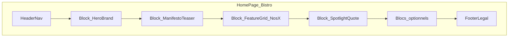
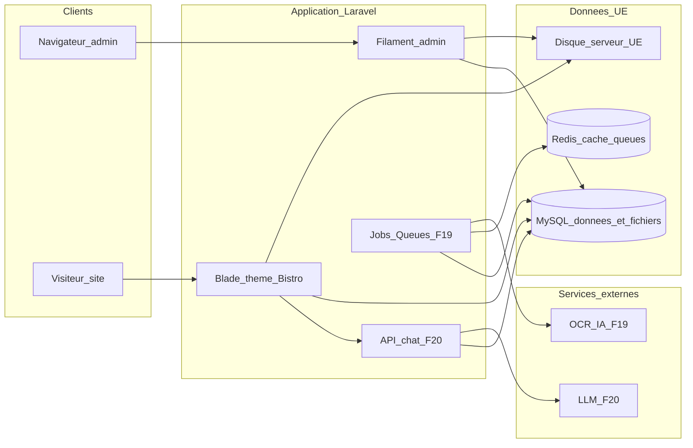

# Cahiers des charges — Plateforme de gestion de site restaurant

*Document unifié : cahier des charges complet (persistance **MySQL** / **UE**, sécurité, emails) et **fonctionnalité phare assistant IA / chat visiteur** (F20).*

---

## 1. Compte rendu (synthèse des décisions)

**Vision produit** : outil **intuitif** permettant au restaurateur de gérer **l’ensemble** de son site vitrine (contenu, horaires, carte, médias, réservation, légal, SEO local) sans compétences techniques. Le **thème développé en amont impose la structure** (types de pages, ordre des blocs, grilles, composants disponibles) ; l’**administrateur personnalise au maximum** ce qui relève de l’**identité et du contenu** : **couleurs**, **tokens d’ambiance** (**ombres**, **rayons de bordure**), **typographie** (liste thème **et** **upload de polices personnalisées** sous contraintes), **logo**, **favicon**, **pictogrammes** où prévus, **tous les textes**, **images** par emplacement (hero, sections, galerie, plats, équipe, etc.), **réseaux** — **sans modifier la structure de base** (pas de glisser-déposer de sections, pas de création de nouvelles zones hors catalogue du thème). **Saisie de carte** : possibilité d’**importer** le contenu à partir d’une **photo de carte menu physique** (traitement automatisé + **reprise et validation** dans le back-office).

**Fonctionnalité phare (visiteur)** : **assistant conversationnel intégré au site public** (**F20**) — le client pose des questions en langage naturel (ex. « Je veux un plat végétarien pas épicé », « Quel vin avec ce plat ? ») ; les réponses s’appuient sur la **carte et les métadonnées** présentes en base, avec **garde-fous** et **paramètres** côté administrateur (cf. **§3.5**, **§5.8**, **§7**).

**Cible** : restaurateurs (bistrot, brasserie, gastronomie, etc.) — priorité à la **simplicité**, à la **cohérence visuelle** du thème et à la **publication fiable**.

**Périmètre fonctionnel retenu** (rappel) : identité et coordonnées, horaires et exceptions, carte/menus structurée (prix, allergènes) **dont import assisté par photo de menu**, **réservation intégrée** : **prise de réservation côté site** et **gestion complète dans le back-office** selon **services** (ex. midi / soir), **capacité en couverts** et **paramètres éditables par l’administrateur** (créneaux, délais, règles) — **complément possible** : lien ou embed vers un outil tiers si l’établissement le souhaite ; galerie, pages fixes, actus/événements, SEO / JSON-LD, formulaires, tableau de bord, personnalisation visuelle **étendue** ; **connexion back-office** avec **sélection du type de profil** avant authentification (référence UX **PRONOTE**, cf. §3.2) ; **assistant IA / chat** sur le site public (**F20**).

**Thème MVP** : **un seul design — template « Bistro »**. **Référence d’inspiration principale** (structure de page, hiérarchie de contenu, rythme des sections, types de blocs — **pas de copie** visuelle ni de contenu) : le site **[bouillonlesite.com](https://bouillonlesite.com/)**. Compléter par **tendances UI** et **veille concurrents** avant figé du **manifeste** et des vues Blade.

**Stack technique retenue** : **PHP**, **Laravel**, **MySQL**, **Redis** (cache, sessions et **files** de queue — **données non durables** ou reconstituables, pas de substitut au stockage métier), **back-office Filament**. Site public en **Blade + Vite**. **Persistance** : **aucune donnée métier** en dehors de **MySQL** ; **fichiers** (images, polices, PDF, photos de carte) **hébergés sur le serveur d’application** (disque local ou volume **strictement en Union européenne**) et/ou **en base MySQL** (ex. **BLOB** + métadonnées) — **pas d’Amazon S3** ni d’autre stockage objet cloud hors périmètre ainsi défini. **Queues Laravel** pour publication/rebuild et traitement asynchrone (**F19** : OCR / services **IA d’extraction** — cf. ci-dessous) ; **traitement des données et fichiers utilisateurs : résidence UE** pour le socle produit (cf. **§7**). **F19** et **F20** ne partagent **pas** le même « concept fournisseur » : **F19** = **fournisseur(s) OCR et/ou IA spécialisés** (reconnaissance / structuration de carte) ; **F20** = **fournisseur LLM** dédié au **chat visiteur** — appels **côté serveur** uniquement, menu injecté depuis **MySQL** ; **DPA** et **région d’hébergement / traitement** du LLM documentés, avec **option région UE** ou équivalent si **exigence contractuelle stricte** (RGPD, **§4**, **§7.1**).

**Architecture cible MVP** : **application Laravel unique** avec séparation modules (admin vs public), hébergement des sites clients par **domaine ou sous-domaine** ; évolution possible vers séparation admin/renderer si la charge l’exige.

---

## 2. Cahier des charges — objectifs et périmètre

### 2.1 Objectifs métier

- Réduire le temps entre inscription et **site en ligne** (objectif chiffré à fixer en phase de lancement, ex. < 1 h avec contenu minimal).
- Permettre des **mises à jour autonomes** (carte, horaires, photos) sans intervention prestataire.
- Assurer un rendu **professionnel** : **cohérence structurelle** garantie par le thème, **différenciation** forte par la personnalisation visuelle et éditoriale pilotée depuis le back-office.
- Offrir une **expérience visiteur différenciante** via l’**assistant menu / vins** (**F20**) tout en maîtrisant **coûts**, **abus** et **conformité**.

### 2.2 Hors périmètre (MVP explicite — à ajuster)

- Prise de commande en ligne / livraison complète (peut être phase ultérieure).
- CRM avancé, fidélisation complexe.
- Multilingue complet (prévoir extensibilité du modèle de données sans l’implémenter au MVP si non prioritaire).

### 2.3 Personas et profils de connexion (back-office)

Les **profils** sont **sélectionnés sur la page de connexion** (comme sur **[PRONOTE](https://e972000a.index-education.net/pronote/)** : choix du « type d’utilisateur » **avant** saisie des identifiants), puis le système vérifie que le compte possède bien **ce rôle** pour l’établissement.

- **Gérant / propriétaire** : accès complet (contenu, apparence, paramètres réservation, réservations, utilisateurs de l’établissement, **paramètres assistant IA F20**).
- **Gestionnaire salle / réservations** : gestion du **planning des réservations** et des **paramètres de réservation** ; accès lecture ou édition limitée au contenu site selon politique à trancher.
- **Rédacteur contenu** (option MVP) : édition contenu vitrine (textes, médias, carte) **sans** paramètres sensibles ni réservations.

*(Les intitulés affichés à l’écran peuvent être libellés métier ; la liste exacte des profils MVP est à valider.)*

### 2.4 Règle produit — structure vs personnalisation

| Figé (développeur / thème)                                | Éditable à fond (admin / back-office)                                                                                                                                                                                                                                                                                                                                                                                                                                                     |
| --------------------------------------------------------- | ----------------------------------------------------------------------------------------------------------------------------------------------------------------------------------------------------------------------------------------------------------------------------------------------------------------------------------------------------------------------------------------------------------------------------------------------------------------------------------------- |
| Types de pages, enchaînement et nombre des blocs par page | Couleurs parmi les **tokens** exposés (primaire, secondaire, accent, fond, texte, liens, états)                                                                                                                                                                                                                                                                                                                                                                                           |
| Grille, responsive, accessibilité des composants          | Logo, favicon, éventuellement **logo inverse** pour fond sombre                                                                                                                                                                                                                                                                                                                                                                                                                           |
| Composants disponibles (carte, horaires, CTA, etc.)       | Images / vidéos par **slot** (dimensions et ratios imposés par le thème)                                                                                                                                                                                                                                                                                                                                                                                                                  |
| SEO technique (sitemap, balises de base)                  | **Tous les textes** ; **pictos** (bibliothèque thème ou upload, cf. F18) ; **typographie** : sélection parmi les polices **incluses au thème** **et** **upload de polices personnalisées** (formats autorisés, poids max, sous-ensemble **WOFF2** côté public après conversion si nécessaire) ; **tokens de forme** : **rayons de bordure** (échelle ou par composant selon manifeste), **ombres** (niveaux prédéfinis ou tokens `shadow-sm` / `md` / `lg` — pas de CSS arbitraire libre) |

**Prévisualisation** : tout changement de marque (tokens + médias) doit être visible en **aperçu** avant publication.

### 2.5 Référence design — [bouillonlesite.com](https://bouillonlesite.com/) (template Bistro)

**Statut** : **source d’inspiration** pour le gabarit « Bistro » — le produit doit livrer une **identité propre** (composants, nommage, assets par défaut) et respecter le **droit d’auteur** et l’**image de marque** des tiers (pas de reprise de textes, visuels ou logo Bouillon).

**Patterns éditoriaux et structurels à transposer** (adaptés au **site d’un seul établissement** sauf évolution multi-sites) :

- **Accueil** : en-tête de marque + **accroche** / sous-titre ; bloc **récit ou manifeste** (histoire, ADN) avec paragraphes et lien **« En savoir plus »** vers une page détail (équivalent **Notre histoire** / à propos).
- **Sections répétables** : rubrique type **« Nos … »** (ex. offres, espaces, formules) composée d’**articles** — chacun avec **titre**, **texte descriptif**, **CTA** optionnel vers une page interne, **visuel** optionnel selon slots du manifeste. *(Sur la référence, la logique est multi-adresses ; pour un bistrot seul, réutiliser le même composant pour « privatisation », « terrasse », « service midi », etc.)*
- **Mise en avant d’offre / service** : bloc **citation ou accroche** + **mention de source** (légende, média partenaire) + **lien** — pour promouvoir ex. click & collect, menu du jour, événement (champs éditables dans Filament).
- **Navigation secondaire** : liens clairs vers pages profondes (histoire, services) sans surcharger le menu principal.
- **Pied de page** : liens **légal** (ex. politique de confidentialité) cohérents avec F10.

**Livrable design** : maquettes **Bistro** + grille responsive documentant **quels blocs** correspondent aux patterns ci-dessus et **quels slots** (F17) sont obligatoires ou optionnels sur l’accueil ; intégration **widget chat F20** (position, mobile, accessibilité). **Détail opérationnel** : **§2.6** (wireframes, catalogue de blocs, manifeste).

### 2.6 Design Bistro — wireframes, blocs d’accueil et manifeste thème

Cette section **unifie** la spécification design / technique du template **Bistro** pour l’implémentation (**Blade**, **Filament**, fichier **manifeste**) et les livrables **Figma / Penpot** (ou équivalent). L’inspiration [bouillonlesite.com](https://bouillonlesite.com/) reste **structurelle uniquement** (cf. §2.5).

#### 2.6.1 Inventaire des wireframes — site public

Chaque wireframe est décrit en **zones nommées** (pas de pixel-perfect) ; préciser les états **desktop / tablette / mobile** lorsque le comportement diffère. Documenter sur **un ou deux écrans clés** les **états transverses** : contenu vide (onboarding), chargement, erreur réseau.

| ID  | Écran / gabarit                       | Contenu / contraintes                                                                                                                                                        |
| --- | ------------------------------------- | ---------------------------------------------------------------------------------------------------------------------------------------------------------------------------- |
| W1  | **Accueil**                           | En-tête marque, accroche, manifeste + lien « En savoir plus », sections « Nos … », mise en avant (citation + source + lien), navigation secondaire, footer légal (cf. §2.5). |
| W2  | **Navigation globale**                | Header : logo, liens primaires, CTA réservation ; menu **mobile** (drawer ou accordéon).                                                                                     |
| W3  | **Page carte (F5)**                   | Catégories, plats, prix, pictogrammes allergènes (F18), option lien PDF.                                                                                                     |
| W4  | **Parcours réservation (F6)**         | Étapes selon paramètres admin : service / date / créneau ou couverts → coordonnées client → confirmation ; erreurs capacité / fermeture.                                     |
| W5  | **Contact (F11)**                     | Formulaire ; emplacement **honeypot** / **Turnstile** (§5.3).                                                                                                                |
| W6  | **Galerie (F7)**                      | Grille, légendes ; lightbox ou page détail (choix MVP).                                                                                                                      |
| W7  | **Page éditoriale (F8)**              | À propos / équipe / privatisation : hero optionnel, textes, slots médias.                                                                                                    |
| W8  | **Actus — liste et détail (F9)**      | Liste chronologique + article.                                                                                                                                               |
| W9  | **Légal (F10)**                       | Texte long ; table des matières optionnelle.                                                                                                                                 |
| W10 | **Coordonnées et horaires (F3 / F4)** | Adresse, carte, horaires, message si fermé.                                                                                                                                  |
| W11 | **Widget chat F20**                   | Position fixe (ex. bas-droite), panneau ouvert / fermé, saisie, **disclaimer** ; **focus clavier**, libellés **ARIA** (§4, §5.8).                                            |

**Priorité wireframes gris (J1 / parcours critique)** : **W1**, **W2**, **W3**, **W4**, **W11** ; puis maquettes haute fidélité avec **tokens** du manifeste et **grille** + **zones sûres** des slots.

#### 2.6.2 Catalogue des blocs d’accueil (figé par le thème)

Les **identifiants** ci-dessous sont stables pour les vues **Blade** et la config **Filament**. L’**ordre d’affichage par défaut** est celui du **manifeste** ; l’administrateur **ne réordonne pas librement** les blocs (pas de page builder libre — cohérent §2.4). **Activation**, **désactivation** ou **répétition** (ex. plusieurs grilles « Nos … ») selon **règles exposées dans le manifeste**.

| Identifiant              | Rôle               | Champs / slots principaux                                                               |
| ------------------------ | ------------------ | --------------------------------------------------------------------------------------- |
| `Block_HeroBrand`        | Accroche d’entrée  | Slot image hero (F17), nom établissement, slogan, CTA (ex. Réserver, Carte).            |
| `Block_ManifestoTeaser`  | Récit court        | Titre section, texte riche limité, lien interne vers page histoire.                     |
| `Block_FeatureGrid_NosX` | Rubrique « Nos … » | Répétable : cartes avec titre, texte, CTA optionnel, **slot vignette** optionnel (F17). |
| `Block_SpotlightQuote`   | Mise en avant      | Citation, attribution / source, média optionnel, lien.                                  |
| *Optionnels MVP*         | À trancher         | Teaser actus, bandeau horaires, mini-galerie, embed réservation tiers.                  |

#### 2.6.3 Structure du manifeste thème (PHP)

Fichier cible indicatif : `themes/bistro/manifest.php` (chemin exact à fixer à l’init du dépôt Laravel). Le manifeste est la **source de vérité** partagée entre **prévisualisation (F13)**, **Filament** et le **site public**.

| Section      | Contenu                                                                                                                                      |
| ------------ | -------------------------------------------------------------------------------------------------------------------------------------------- |
| `meta`       | `id`, `name`, `version`, lien vers artefact design (audit interne, pas de copie Bouillon).                                                   |
| `tokens`     | Couleurs exposées (F16), échelle **radius**, niveaux **shadow** (sm / md / lg).                                                              |
| `typography` | Polices **préautorisées** ; règles **upload** (formats, poids max, WOFF2 côté public).                                                       |
| `slots`      | F17 : par slot — `id`, ratio ou dimensions cibles, taille min., **zone sûre**, `required_on` (ex. hero accueil obligatoire), `alt_required`. |
| `blocks`     | Liste des blocs §2.6.2 : composant Blade, champs Filament, contraintes (min/max cartes pour les repeaters).                                  |
| `navigation` | Emplacements : primaire, secondaire, footer légal ; libellés par défaut.                                                                     |
| `widgets`    | **Chat F20** : activation par défaut, position (coin), `z-index`, comportement mobile éventuel.                                              |
| `pictograms` | F18 : emplacements (allergènes, services, footer) — bibliothèque vs upload.                                                                  |

**Artefacts externes** : dossier type `docs/design/` dans le dépôt — export PDF ou lien **Figma / Penpot**, **inventaire des slots**, table **bloc ↔ composant Blade** ; référencer le lien en tête de §2.6 ou en §12 une fois figé.

#### 2.6.4 Wireframes back-office (phase 2 design)

Les écrans **Filament** détaillés (F1 connexion deux étapes, F19 reprise OCR, paramètres réservation) peuvent faire l’objet de wireframes **légers en seconde phase** ; le **focus MVP design** reste le **site public Bistro** et le **widget F20**.

---

## 3. Exigences fonctionnelles

| ID      | Domaine                          | Description                                                                                                                                                                                                                                                                                                                                                                                                                                                                                                                                                                                                                                                                                                                                                                                                                                                                                                                                                                                                                                                                                                                                               |
| ------- | -------------------------------- | --------------------------------------------------------------------------------------------------------------------------------------------------------------------------------------------------------------------------------------------------------------------------------------------------------------------------------------------------------------------------------------------------------------------------------------------------------------------------------------------------------------------------------------------------------------------------------------------------------------------------------------------------------------------------------------------------------------------------------------------------------------------------------------------------------------------------------------------------------------------------------------------------------------------------------------------------------------------------------------------------------------------------------------------------------------------------------------------------------------------------------------------------------- |
| F1      | Comptes et accès admin           | Création / invitation de comptes, rattachement **tenant** ; **page de connexion au back-office** avec **sélection du profil** (tuiles ou liste, type **[PRONOTE](https://e972000a.index-education.net/pronote/)**), puis identifiants ; refus explicite si le rôle du compte ne correspond pas au profil choisi ; récupération mot de passe ; **Filament** + policies par rôle.                                                                                                                                                                                                                                                                                                                                                                                                                                                                                                                                                                                                                                                                                                                                                                           |
| F2      | Identité et marque               | Nom commercial, slogan, **logo** (variants si prévus), **favicon**, **palette** (tokens couleur), réseaux sociaux ; conformité aux **contraintes** du thème (contrastes min., tailles min. logo).                                                                                                                                                                                                                                                                                                                                                                                                                                                                                                                                                                                                                                                                                                                                                                                                                                                                                                                                                         |
| F3      | Coordonnées                      | Adresse, carte/itinéraire, téléphone, email, infos pratiques (parking, accessibilité).                                                                                                                                                                                                                                                                                                                                                                                                                                                                                                                                                                                                                                                                                                                                                                                                                                                                                                                                                                                                                                                                    |
| F4      | Horaires                         | Horaires par jour, exceptions (fériés, congés), message affiché si fermé.                                                                                                                                                                                                                                                                                                                                                                                                                                                                                                                                                                                                                                                                                                                                                                                                                                                                                                                                                                                                                                                                                 |
| F5      | Carte                            | Catégories, plats, prix, description courte, pictogrammes allergènes / régimes, ordre d’affichage, option PDF ; **import depuis photo** de carte menu physique (cf. F19).                                                                                                                                                                                                                                                                                                                                                                                                                                                                                                                                                                                                                                                                                                                                                                                                                                                                                                                                                                                 |
| F6      | Réservation intégrée             | **Paramétrage entièrement piloté par l’administrateur** dans le back-office : **services** (ex. déjeuner, dîner), jours et plages horaires, **granularité des créneaux** (pas de temps, fenêtres), **répartition de la capacité** (couverts par service, par jour et/ou par créneau selon les options proposées par l’UI), durée de service, **délais min. et max.** (réservation à l’avance, dernière heure d’acceptation), **politique d’annulation côté client** (autorisée ou non, délai, conditions), messages et champs obligatoires du formulaire public (nom, téléphone, email, couverts, allergènes / notes optionnelles). L’**application** applique des **bornes de validation** (cohérence, pas de capacité négative, etc.) et une **cohérence vérifiable** avec F4 le cas échéant. **Site public** : parcours **soumis aux paramètres** ci-dessus. **Back-office** : **liste / calendrier**, statuts (en attente, confirmée, refusée, annulée, no-show), édition manuelle, **anti-surbooking** (transaction ou contrôle à la validation). **Notifications** : **§6**. **Option** : URL ou embed **partenaire** (TheFork, etc.) si configuré. |
| F7      | Galerie                          | Upload, légendes, ordre, formats acceptés.                                                                                                                                                                                                                                                                                                                                                                                                                                                                                                                                                                                                                                                                                                                                                                                                                                                                                                                                                                                                                                                                                                                |
| F8      | Pages éditoriales                | Contenus « À propos », équipe, privatisation — champs alignés sur le thème.                                                                                                                                                                                                                                                                                                                                                                                                                                                                                                                                                                                                                                                                                                                                                                                                                                                                                                                                                                                                                                                                               |
| F9      | Actus / événements               | Titre, date, visuel, corps ; archivage ou masquage après date (règle à préciser).                                                                                                                                                                                                                                                                                                                                                                                                                                                                                                                                                                                                                                                                                                                                                                                                                                                                                                                                                                                                                                                                         |
| F10     | Légal                            | Pages mentions / confidentialité / cookies à partir de **modèles** éditables (responsabilité contenu côté client).                                                                                                                                                                                                                                                                                                                                                                                                                                                                                                                                                                                                                                                                                                                                                                                                                                                                                                                                                                                                                                        |
| F11     | Contact                          | Formulaire avec sujets prédéfinis, protection anti-spam (ex. honeypot + rate limiting).                                                                                                                                                                                                                                                                                                                                                                                                                                                                                                                                                                                                                                                                                                                                                                                                                                                                                                                                                                                                                                                                   |
| F12     | Publication                      | Brouillon / publié ; déclenchement job de mise à jour du site public et invalidation cache CDN si applicable.                                                                                                                                                                                                                                                                                                                                                                                                                                                                                                                                                                                                                                                                                                                                                                                                                                                                                                                                                                                                                                             |
| F13     | Prévisualisation                 | Aperçu cohérent avec le rendu public (même moteur de vues).                                                                                                                                                                                                                                                                                                                                                                                                                                                                                                                                                                                                                                                                                                                                                                                                                                                                                                                                                                                                                                                                                               |
| F14     | Tableau de bord                  | Checklist d’onboarding, alertes champs manquants, lien rapide vers édition.                                                                                                                                                                                                                                                                                                                                                                                                                                                                                                                                                                                                                                                                                                                                                                                                                                                                                                                                                                                                                                                                               |
| F15     | SEO                              | Meta titre/description par page clé ; sitemap ; **JSON-LD** Restaurant dérivé des champs structurés.                                                                                                                                                                                                                                                                                                                                                                                                                                                                                                                                                                                                                                                                                                                                                                                                                                                                                                                                                                                                                                                      |
| F16     | Apparence globale                | Écran « **Apparence** » : tokens **couleur**, **rayons de bordure**, **ombres** ; **polices** (liste thème + **upload** avec validation) ; assets globaux ; **réinitialisation** aux défauts du template Bistro (option).                                                                                                                                                                                                                                                                                                                                                                                                                                                                                                                                                                                                                                                                                                                                                                                                                                                                                                                                 |
| F17     | Médias par zone                  | Pour chaque **slot image** du thème (hero, bandeaux, sections, vignettes) : upload, recadrage assisté ou **zones sûres** documentées, texte alternatif, ordre si galerie.                                                                                                                                                                                                                                                                                                                                                                                                                                                                                                                                                                                                                                                                                                                                                                                                                                                                                                                                                                                 |
| F18     | Pictogrammes                     | Où le thème prévoit des icônes (allergènes, services, footer) : sélection dans une **bibliothèque** et/ou remplacement par pictos fournis selon règles (format, taille).                                                                                                                                                                                                                                                                                                                                                                                                                                                                                                                                                                                                                                                                                                                                                                                                                                                                                                                                                                                  |
| F19     | Import carte par photo           | Upload **une ou plusieurs** photos lisibles de la carte papier/tableau ; **traitement asynchrone** (file) via **fournisseur(s) OCR et/ou IA d’extraction** (reconnaissance texte, mise en forme structurée) — **hors périmètre** du **LLM conversationnel F20** ; proposition d’une **structure brouillon** (sections, libellés plats, prix détectés) ; affichage en **Filament** pour **correction ligne à ligne**, fusion avec la carte existante ou remplacement guidé ; **conservation** de l’image source en média (option) pour traçabilité ; gestion des **échecs** (photo floue, langue atypique) avec message actionnable.                                                                                                                                                                                                                                                                                                                                                                                                                                                                                                                       |
| **F20** | **Assistant IA / chat visiteur** | **Widget chat** sur le **site public** (template Bistro), **sans compte**. Réponses fondées sur le **menu et métadonnées** du restaurant en **MySQL** (catégories, plats, descriptions, allergènes / régimes, **carte des vins** ou champs vins si modélisés). Exemples : « plat végétarien pas épicé », « quel vin avec ce plat ? ». **Garde-fous** : disclaimer du type *information indicative — confirmer auprès du service* ; **interdiction d’inventer** prix ou disponibilités ; renvoi vers **contact** / **réservation** si hors périmètre. **Filament** : activer/désactiver le chat, **consigne système** ou texte légal optionnel, **quotas** (messages / session / jour).                                                                                                                                                                                                                                                                                                                                                                                                                                                                    |

### 3.1 Détail F6 — réservations (règles produit)

- **Paramètres métier** : **granularité des créneaux**, **mode de capacité** (ex. par créneau, par service, par jour — selon les **options** offertes dans Filament), **annulation par le client** (autorisée ou non, délais), **délais min. / max.** avant le service sont **définis par l’administrateur** ; le produit fournit des **valeurs par défaut** raisonnables à l’onboarding mais **aucune valeur figée** au CDC pour ces réglages.
- **Validation applicative** : l’application impose des **bornes** (ex. pas de capacité négative, pas de créneaux incohérents) et, si F4 est relié aux services, une **cohérence vérifiable** avec les horaires (avertissement si incohérence).
- **Source de vérité** : les **horaires** (F4) peuvent **préremplir** les services ou rester **découplés** (midi sans soir, etc.).
- **Capacité** : toute confirmation doit respecter la **capacité résiduelle** selon les règles **configurées** (ex. 12h00–12h30 : N couverts max si le modèle « par créneau » est activé).
- **Notifications** : **§6** (emails client / équipe, confirmations, échecs d’envoi journalisés).
- **Données personnelles** : conservation des réservations conforme **RGPD** (durée, anonymisation éventuelle).

### 3.2 Détail F1 — connexion type PRONOTE

- **Écran 1** : choix du **profil** (Gérant, Réservations, Rédacteur…) — libellés et pictos accessibles (WCAG).
- **Écran 2** (ou même écran selon maquette) : **email / identifiant** + **mot de passe** ; case « se souvenir » selon politique de sécurité.
- **Sécurité** : le serveur vérifie que le compte possède le **rôle attendu** pour le profil sélectionné ; pas d’**élévation** de privilèges par simple manipulation du formulaire ; **rate limiting** sur la connexion et sur le **formulaire public de réservation** (détail **§5**).
- **Implémentation** : **page de login Filament personnalisée** (ou route pré-auth dédiée) ; session standard Laravel.

### 3.3 Détail F19 — exigences techniques (à trancher en conception)

- **File d’attente** : job Laravel après upload ; barre de progression / notification dans l’admin.
- **Pipeline** : **fournisseur(s) dédiés F19** — combinaison **OCR** (ex. Tesseract auto-hébergé, ou API type **Google Document AI** / **AWS Textract** / **Azure** / équivalent) et, si pertinent, **couche IA d’extraction ou de structuration** orientée document (vision, parsing menu) et/ou **règles heuristiques** pour passer du texte brut à catégories + items + prix. **Ne pas regrouper** sous l’étiquette générique « LLM produit » : le **LLM de F20** est un **autre sous-traitant**, au **contrat et aux paramètres distincts** ; toute utilisation d’un modèle génératif **uniquement** pour enrichir F19 reste explicitement **cantonnée à F19** (DPA / périmètre de données séparés).
- **Qualité** : formats image acceptés, taille max, recommandations UX (lumière, cadrage) affichées avant envoi.
- **Données personnelles / RGPD** : photo peut contenir des éléments non nécessaires au site ; stockage et durée de rétention à documenter ; **DPA** et **région** des APIs **OCR/IA F19** identifiés comme pour tout sous-traitant (**§4**, **§7.1**).

### 3.4 Fonctions « intelligence / automatisation » (compléments post-MVP ou allégés)

- Suggestions de textes (accueil, meta) à partir du type de cuisine et de la ville.
- Rappels planifiés (horaires fériés, plats sans photo).
- Rapport mensuel simplifié (trafic basique si analytics intégré).

*(L’import photo de carte est **MVP** via F19 ; l’affinage du modèle de parsing peut évoluer en itérations.)*

### 3.5 Détail F20 — assistant conversationnel (chat site public)

- **Source de contexte** : chargement / extrait structuré du **menu** (et vins si présents) depuis **MySQL** pour le `**restaurant_id`** de la requête — **isolation tenant stricte** ; aucune fuite du menu d’un autre établissement.
- **Fournisseur** : **LLM** (fournisseur **unique ou interchangeable** au choix produit : **OpenAI**, **Mistral**, **Anthropic**, **Azure OpenAI**, etc.) — **contrat, DPA et localisation** traités **spécifiquement pour F20** ; en cas d’**exigence stricte** (données en UE, résidence, pas de transfert hors UE), privilégier une **offre avec région UE** ou équivalent documenté (SCC, options régionales) — **indépendamment** des choix **OCR/IA F19**.
- **Flux** : le navigateur appelle une **route Laravel** (POST, option **SSE / streaming** pour affichage progressif) ; le **contrôleur** assemble le contexte + question utilisateur ; appel **API LLM** **uniquement côté serveur** ; **clés** en variables d’environnement — **jamais** exposées au client.
- **RAG / évolutivité** : **phase 1** — prompt avec extrait menu (JSON ou texte borné) ; **phase 2** — embeddings / recherche vectorielle si la carte est très volumineuse (index vectoriel : service **UE** de préférence ou DPA documenté).
- **Persistance optionnelle** : tables `**chat_sessions`** / `**chat_messages`** en **MySQL** pour support, analytics et amélioration — **RGPD** : durée de rétention, anonymisation, mention dans la politique de confidentialité.
- **Contenu généré** : post-traitement pour **citer** ou **limiter** aux plats effectivement présents ; refus poli si la question dépasse les données disponibles.

---

## 4. Exigences non fonctionnelles (générales)

- **Performance** : temps de chargement public conforme aux bonnes pratiques (objectifs Core Web Vitals à définir ; images optimisées, lazy load).
- **Disponibilité** : cible SLA à définir (ex. 99,5 % MVP).
- **Sécurité** : exigences détaillées en **§5** (back-office, site public, uploads, multi-tenant, exploitation, **F20** en **§5.8**).
- **RGPD** : traitement des données personnelles (formulaires, comptes, réservations, **conversations F20** si journalisées), registre, DPA si sous-traitants, cookies conformes aux choix juridiques retenus ; alignement des emails transactionnels **§6**. **Résidence** : contenu applicatif et fichiers **hébergés en UE** (**§7**) ; pour les **prestataires externes** : **mail** (**§6**), **OCR / IA F19**, **LLM F20** — chaque famille avec **DPA** et **localisation** (dont **région** si exigence stricte) conformes aux engagements produit, **sans fusionner** F19 et F20 au même titre contractuel.
- **Accessibilité** : objectif WCAG (niveau visé à trancher : AA recommandé pour le public et pour l’admin dans la mesure du raisonnable) ; widget chat utilisable au clavier et avec lecteur d’écran dans la mesure du possible.
- **Messagerie** : exigences détaillées en **§6**.

---

## 5. Sécurité (spécification détaillée)

### 5.1 Transport et configuration plateforme

- **HTTPS** obligatoire en production pour **admin** et **site public** ; **HSTS** recommandé sur les domaines applicatifs.
- **Secrets** : variables d’environnement / coffre ; jamais de secrets dans le dépôt ; rotation documentée (SMTP, clés **OCR/IA F19**, **clés LLM F20**, etc.) — **jeux de clés séparés** selon les fournisseurs.
- **Production** : `APP_DEBUG=false` ; pages d’erreur génériques sans fuite de stack trace ; journalisation centralisée des erreurs (niveau adapté, pas de données personnelles en clair dans les logs).

### 5.2 Back-office (Filament / Laravel)

- **Authentification** : mot de passe hashé (**bcrypt** / **Argon2id** selon config Laravel) ; politique de **longueur minimale** (et complexité optionnelle) configurable ; **réinitialisation mot de passe** par lien à usage limité dans le temps et **à jeton unique**.
- **Sessions** : driver **Redis** ou **database** en prod ; cookie de session **HttpOnly**, **Secure**, **SameSite** adapté (Lax/Strict selon parcours) ; **timeout d’inactivité** configurable ; **régénération de session** après authentification réussie.
- **Autorisation** : **policies** / **gates** Laravel sur **chaque** action sensible ; contrôle systématique du **tenant** (`restaurant_id`) sur les requêtes et ressources Filament ; le **profil sélectionné** à la connexion (F1) doit **restreindre** le menu et les actions (pas d’escalade par manipulation de requête).
- **CSRF** : protection active sur **tous** les formulaires POST/PATCH/DELETE (Filament, Livewire).
- **Brute force** : **rate limiting** sur la route de login (par **IP** et, si possible, par **identifiant**) ; délai progressif ou **CAPTCHA activable** après seuil d’échecs — **référence produit : [Cloudflare Turnstile](https://developers.cloudflare.com/turnstile/)** (intégration côté formulaires concernés, clés en secrets d’environnement).
- **En-têtes HTTP** (réponse admin et public) : au minimum **X-Content-Type-Options: nosniff**, **Referrer-Policy** restrictive, **X-Frame-Options** ou **frame-ancestors** via **CSP** pour limiter le clickjacking ; **Content-Security-Policy** progressivement renforcée (idéalement avec **nonces** pour scripts inline si nécessaire).
- **Audit** : journal des **connexions échouées** ; journal des **actions critiques** (création/suppression d’utilisateurs, changement des paramètres de réservation, publication majeure) avec **qui / quoi / quand / tenant** — aligné avec F6/F12.
- **Chemins d’admin** : URL dédiée stable ; option **liste blanche IP** ou **VPN** réservée aux environnements sensibles (hors MVP sauf besoin client).
- **2FA** : **hors MVP** sauf demande explicite ; prévoir **extensibilité** (TOTP) pour les comptes gérants.

### 5.3 Site public — formulaires (contact F11, réservation F6, autres POST)

- **CSRF** sur **chaque** soumission de formulaire state-changing.
- **Validation serveur** stricte : types, longueurs maximales, formats **email** / **téléphone**, **couverts** dans des bornes réalistes ; rejet des champs inattendus (mass assignment protégé).
- **XSS** : échappement **Blade** par défaut pour toute donnée utilisateur ; si zone riche (futur) : **allowlist** HTML stricte ou Markdown sanitizé.
- **Anti-abus** : **rate limiting** par **IP** (et par **fingerprint** léger optionnel) sur contact, réservation, upload menu ; **honeypot** et/ou **délai minimum** de formulaire ; **CAPTCHA activable** si volumétrie spam — **Cloudflare Turnstile** comme solution privilégiée (cohérent avec **§5.2**).
- **Énumération** : messages d’erreur **génériques** sur flux sensibles (reset password, réservation) pour ne pas révéler l’existence d’emails ou de créneaux de façon abusive.
- **Liens signés** : toute action sensible côté client sans session (ex. **annulation** de réservation par le client) doit utiliser une **URL signée** à durée de vie limitée.

### 5.4 Uploads (médias F7/F17, polices F16, photo carte F19)

- **Allowlist** des **extensions** et des **MIME** ; taille maximale **serveur** (et message utilisateur clair).
- Fichiers stockés sous **nom non prévisible** sur **disque serveur UE** et/ou **MySQL (BLOB)** selon implémentation ; **métadonnées et chemins** en base ; accès via routes **contrôlées** ou URLs signées **sans** dépendre d’un CDN public hors UE par défaut ; pas d’exécution PHP dans le répertoire de dépôt.
- **SVG** : interdits en MVP ou **sanitization** stricte (pas de scripts embarqués).
- **Polices** : validation du format ; stockage séparé ; pas d’exécution côté serveur.
- **Scan antivirus** (ex. ClamAV) : **phase 2** recommandée si risque élevé.

### 5.5 Multi-tenant et données

- **Global scopes** / **middleware** tenant : impossible de lire ou modifier les données d’un **autre** établissement ; tests automatisés d’**isolation** (IDs cross-tenant).
- **Exports** Filament : mêmes contraintes de scope.
- **Sauvegardes** chiffrées au repos (infrastructure) ; procédure de **restauration** testée (cf. critères d’acceptation).

### 5.6 Jobs, files et intégrations (F19 OCR/IA, mail)

- **Queues** : pas de secrets en clair dans les payloads loggés ; retries avec **backoff** ; échecs définitifs **journalisés** et notifiés (cf. §6.3). Les jobs **F19** n’emploient **pas** les mêmes endpoints / credentials que le **LLM F20** sauf décision d’architecture exceptionnelle explicitement documentée.
- **Webhooks** entrants/sortants (futur) : **signature** HMAC et idempotency.

### 5.7 Dépendances et maintenance

- Mise à jour régulière de **Laravel**, **Filament**, **npm** (Vite) ; veille **CVE** ; politique de correctifs de sécurité documentée.

### 5.8 Assistant conversationnel F20 (site public)

- **Rate limiting** renforcé par **IP** et/ou **session anonyme** sur l’endpoint chat ; **taille maximale** des messages et du contexte.
- **Prompt injection** : instructions **système** et règles métier **contrôlées côté serveur** ; le visiteur ne peut pas modifier le **system prompt** ; pas d’exécution de code ni d’appels arbitraires.
- **Affichage des réponses** : **Markdown** restreint ou texte brut sanitizé ; pas de HTML arbitraire du modèle sans filtrage.
- **Coût / abus** : **quotas** par établissement (messages / jour) et plafond global optionnel ; désactivation automatique ou **mode dégradé** si budget tokens dépassé.
- **Données sensibles** : ne pas envoyer au **LLM F20** d’informations hors menu (ex. données réservation d’autres clients).

---

## 6. Notifications e-mail (spécification détaillée)

### 6.1 Infrastructure et délivrabilité

- **Fournisseur retenu (produit)** : envoi transactionnel via **SMTP Google** (compte **Google Workspace** ou configuration **Gmail** selon la politique du compte — mots de passe d’application / OAuth selon doc Google). Variables d’environnement Laravel (`MAIL_`*) ; aligner **DPA** et registre des traitements avec les engagements **Google** et le **RGPD** (**§4**). **Alternative** si besoin futur : API / SMTP managés (**Brevo**, **Mailjet**, **Postmark**, etc.) avec **région UE** et **DPA** — documenter tout changement de routage.
- **Qualité d’envoi** : **pas** d’envoi direct depuis un hébergement mutualisé **non réputé** sans relais authentifié (le relais Google SMTP satisfait ce principe lorsqu’il est correctement configuré).
- **SPF**, **DKIM** et **DMARC** correctement configurés sur le **domaine d’envoi** (domaine applicatif ou sous-domaine dédié `mail.` / `notifications.`).
- Tous les envois passent par la **file Laravel** (`ShouldQueue`) ; worker(s) dédiés en production.
- **Retries** avec **backoff** exponentiel ; après échec définitif : enregistrement en base ou log structuré (**§6.4**) et alerte opérationnelle si besoin.
- **Bounces / plaintes** : processus de traitement (désactivation d’adresses en hard bounce) — au minimum suivi manuel en MVP, automatisé en phase 2.

### 6.2 Catalogue des e-mails (MVP et extensions)

| Code | Déclencheur                                                            | Destinataire(s)                                         | Contenu principal                                                                                                               |
| ---- | ---------------------------------------------------------------------- | ------------------------------------------------------- | ------------------------------------------------------------------------------------------------------------------------------- |
| M1   | Nouvelle demande de réservation (public)                               | **Client**                                              | Accusé de réception, récapitulatif (date, service, couverts), délai de réponse éventuel, lien vers politique de confidentialité |
| M2   | Nouvelle demande de réservation                                        | **Équipe** (adresse(s) configurée(s) par établissement) | Détails complets, lien vers Filament pour traiter                                                                               |
| M3   | Réservation **confirmée**                                              | Client                                                  | Confirmation, rappel des conditions, coordonnées restaurant                                                                     |
| M4   | Réservation **refusée**                                                | Client                                                  | Motif optionnel, incitation à reprendre contact / autres créneaux                                                               |
| M5   | Réservation **annulée** (par le restaurant ou le client si flux prévu) | Client et/ou équipe                                     | Confirmation d’annulation, créneau libéré                                                                                       |
| M6   | **Rappel** avant le service (option V1.1 / V2)                         | Client                                                  | Date/heure, couverts, lien annulation signé si applicable                                                                       |
| M7   | **Réinitialisation** mot de passe                                      | Utilisateur admin                                       | Lien sécurisé à durée limitée                                                                                                   |
| M8   | **Invitation** utilisateur back-office                                 | Nouvel utilisateur                                      | Lien d’activation / définition du mot de passe                                                                                  |
| M9   | **Formulaire de contact** (F11)                                        | Équipe (+ accusé optionnel client)                      | Corps du message, métadonnées anti-spam                                                                                         |
| M10  | **Échec** définitif d’import carte (F19)                               | Gérant / rôle technique                                 | Résumé erreur, lien vers média source                                                                                           |

*(La liste exacte MVP = M1–M5, M7–M9 minimum ; M6 et M10 selon priorisation.)*

### 6.3 Contenu, templates et marque

- Templates **Blade** (ou MJML/HTML responsive) versionnés ; **version texte brut** (**multipart/alternative**) pour **chaque** message.
- En-têtes : **From** / **Reply-To** configurables par établissement (avec garde-fous anti-spoofing : domaine autorisé).
- **Personnalisation** : nom du restaurant, logo optionnel en en-tête (URL stable ou CID), couleurs discrètes — sans casser la délivrabilité (ratio texte/image).
- **Légalement** : mention d’**identité de l’expéditeur**, adresse postale si requis, **lien de politique de confidentialité**, base légale courte pour les données de réservation.
- **Lien d’action** : préférer **HTTPS** ; liens d’annulation / confirmation client en **signed URL** à durée limitée.

### 6.4 Traçabilité et conformité

- Table ou log `**email_outbox`** (option MVP+) : type (M1…), `restaurant_id`, destinataire(s) hashés ou pseudonymisés si besoin, statut (queued, sent, failed), identifiant fournisseur, horodatage — pour **preuve** et support client.
- Respect du **RGPD** : pas de données superflues dans les logs ; durée de conservation des métadonnées d’envoi documentée.
- Messages **transactionnels** : pas de désinscription marketing ; en cas d’erreur d’adresse, traiter comme problème de **données** (mise à jour par l’établissement).

### 6.5 Configuration administrateur (Filament)

- Champs par établissement : **adresse(s)** de notification réservation / contact, **nom d’expéditeur**, **reply-to**, option **copie** interne (BCC) pour certaines catégories.
- **Prévisualisation** de template (staging) ou envoi de **mail de test** réservé aux gérants.
- **Langue** : français par défaut ; extensibilité i18n des templates si multilingue produit.

### 6.6 Alignement avec les jalons

- **J4** : implémentation **M1–M5** (réservations) + infrastructure file + SPF/DKIM de base.
- **J5** : **M7–M8**, durcissement sécurité **§5**, **M9** contact si non fait en J3.

---

## 7. Architecture technique (cible)

### 7.1 Persistance des données et localisation

- **MySQL** : **source de vérité** pour toute la **donnée métier** (établissements, utilisateurs, rôles, carte, réservations, contenus, paramètres, journaux métier, métadonnées d’emails, **paramètres et historiques chat F20** si activés, etc.). **Redis** sert le **cache**, les **sessions** (si configuré ainsi) et les **files** de jobs : **pas** de substitut durable aux enregistrements métier ; en cas de perte Redis, les données restent dans **MySQL** après reconstruction du cache.
- **Fichiers binaires** (images, polices, PDF, imports photo carte) : **pas de S3** ni stockage objet équivalent cloud ; stockage sur le **disque du serveur** situé en **Union européenne** (répertoire non exécutable, sauvegardé avec le reste) et/ou **contenu fichier en MySQL** (type **BLOB**/LONGBLOB selon tailles max) avec métadonnées en lignes dédiées — **choix d’implémentation** à documenter (mix possible : petits fichiers BLOB, gros fichiers disque).
- **Résidence** : **aucun stockage des données et fichiers utilisateurs du produit hors UE** pour le socle applicatif. Les **sous-traitants** sont traités **par famille** : envoi d’emails (**§6**), **OCR/IA F19**, **LLM F20** — chacun avec **DPA** et **analyse de localisation / région** (notamment si **exigence stricte** côté client ou produit) ; en cas d’appel à un service dont les serveurs sont hors UE, **documenter** la base légale et les garanties (SCC, options régionales UE si disponibles). **Aucune confusion** entre le contrat **F19** et le contrat **F20**.
- **Sauvegardes** : snapshots **MySQL** + copies du **disque fichiers** (ou export BLOB) dans une zone **UE** alignée avec la politique de l’hébergeur choisi.

### 7.2 Flux applicatifs complémentaires

- **Modèle multi-tenant** : `restaurant_id` (ou équivalent) sur les entités métier ; isolation stricte dans les requêtes et policies Laravel ; **réservations** et **rôles utilisateurs** strictement **scopés** à l’établissement ; **même exigence pour F20** (menu injecté = tenant courant uniquement).
- **Réservations (F6)** : soumission depuis le **site public** (Blade) ; écriture **transactionnelle** sur capacité ; **notifications** via **queue** + fournisseur mail (**§6**).
- **Import F19** : jobs consomment les médias **UE** ; appels **OCR/IA F19** (cf. **§3.3**) — **pas** d’utilisation implicite du **LLM F20**.
- **Assistant F20** : requêtes **HTTP** depuis le widget vers **Laravel** ; lecture **MySQL** ; appel **fournisseur LLM** asynchrone ou synchrone selon SLA ; **rate limiting** et **quotas** (**§5.8**).
- **Pipeline de publication** : événement « contenu publié » → job(s) : régénération cache applicatif et/ou pages ; **pas de dépendance** à un CDN ou stockage objet public **hors UE** par défaut.
- **Environnements** : dev, staging, prod ; secrets hors code.

---

## 8. Modèle de données (brouillon conceptuel)

Entités principales (à détailler en migrations) : `users` (**rôle** par établissement : gérant, réservation, rédacteur… — table pivot `restaurant_user` ou `role` + `restaurant_id`), `restaurants`, `**booking_services`** (nom, jours, heures début/fin, actif), `**booking_capacity_rules`** (couverts max par service et/ou par **créneau** / pas de temps), `**booking_settings`** (délais min/max, annulation, champs formulaire activés, **emails notification**), `**reservations`** (service, date/heure ou créneau, couverts, coordonnées client, statut, notes, traçabilité), `**restaurant_theme_settings`**, `**custom_fonts`** (référence chemin disque UE et/ou `**file_data` BLOB** selon choix), `**home_sections`**, `opening_hours`, `opening_hour_exceptions`, `menu_categories`, `menu_items` (champs épice / régime / vins accordés si besoin pour F20), `**wines`** ou champs vins associés aux plats (option), `**menu_imports**` ou `**menu_photo_imports**` (média source **disque ou BLOB**), `gallery_media`, `**theme_media_slots`** (**path** ou **binary** + `mime`, `size`), `pages`, `events`, `settings`, `publications` / sync, `**email_outbox`** ou équivalent (**§6.4**), `**ai_chat_settings`** (`restaurant_id`, actif, consignes, quotas), `**chat_sessions`**, `**chat_messages`** (option, persistance conversations F20).

Le thème **Bistro** expose un **manifeste** (config PHP) : slots médias, tokens (couleur, typo, radius, ombre), polices **préautorisées**, limites upload — consommé par **Filament** (formulaires, validation, preview). Les **types de blocs** de la page d’accueil sont **alignés** sur l’analyse de [bouillonlesite.com](https://bouillonlesite.com/) (cf. §2.5).

---

## 9. Livrables et jalons

| Phase | Contenu                                                                                                                                                                                  |
| ----- | ---------------------------------------------------------------------------------------------------------------------------------------------------------------------------------------- |
| J1    | Repo Laravel, auth, multi-tenant, **template Bistro** Blade : accueil avec blocs §2.5 + **manifeste** initial documenté par rapport à [bouillonlesite.com](https://bouillonlesite.com/). |
| J2    | Filament : identité, **apparence**, coordonnées, horaires ; **ébauche page connexion** avec **sélecteur de profil** (F1) ; publication + site public (CSS variables / build tokens).     |
| J3    | Carte complète (**CRUD** + **F19** + validation) + galerie + formulaire contact.                                                                                                         |
| J4    | **Réservations (F6)** : paramètres + liste & calendrier ; formulaire public ; anti-surbooking ; **M1–M5** + infra mail **§6** ; option lien tiers.                                       |
| J5    | **F1** finalisée + policies ; **M7–M9** ; légal, actus, SEO + JSON-LD ; durcissement **§5** et perf.                                                                                     |
| J6    | **F20** : widget chat public, endpoints Laravel, intégration **fournisseur LLM** (DPA / région selon exigence), Filament (on/off, quotas, consignes), tests isolation tenant + **§5.8**. |
| J7    | Automatisations / rappels (M6) / analytics (selon priorisation).                                                                                                                         |

---

## 10. Critères d’acceptation globaux

- Un restaurateur peut remplir la checklist minimale et **publier** un site **template Bistro** ; personnalisation **tokens étendus** + polices uploadées dans les limites du manifeste ; structure de pages **inchangée**.
- **F19** : photo acceptable → brouillon éditable → validation → carte structurée.
- **F6** : configuration services / capacités ; pas de confirmation au-delà de la capacité ; gestion Filament ; **emails M1–M5** déclenchés selon les cas (hors panne fournisseur).
- **F1** : profil incorrect → accès refusé ; rate limiting login effectif (**§5.2**).
- **F20** : questions type **régime / épices / accord mets-vin** produisent des réponses **cohérentes** avec le menu du **tenant** ; **aucune** fuite de menu d’un autre établissement ; désactivation admin **immédiate** sur le site public.
- **§5** : aucune régression CSRF sur formulaires publics et admin ; uploads conformes allowlist.
- Aucune fuite de données entre comptes (tests d’isolation tenant).
- Site public : **HTML** valide de base, **sitemap**, **JSON-LD** si champs requis renseignés.
- Sauvegarde et restauration DB documentées pour la prod.

---

## 11. Risques et mitigations

| Risque                                    | Mitigation                                                                                                              |
| ----------------------------------------- | ----------------------------------------------------------------------------------------------------------------------- |
| Scope creep du page builder               | Structure et blocs figés ; personnalisation = tokens + contenus dans le manifeste.                                      |
| Combinaisons couleurs illisibles          | Contrastes (UI) ; défauts thème.                                                                                        |
| Surcharge cognitive                       | Assistant d’apparence ; onglets ; défauts thème.                                                                        |
| Contenu légal incorrect                   | Modèles + avertissement.                                                                                                |
| Charge sur les médias                     | Compression, limites taille, servir depuis **serveur UE** ; pas de CDN par défaut (ou CDN **UE** uniquement si besoin). |
| Surbooking / concurrence                  | Transactions DB ; capacité au commit.                                                                                   |
| Tiers réservation en parallèle            | Avertissement double saisie.                                                                                            |
| Qualité OCR                               | Validation humaine ; guide photo.                                                                                       |
| Polices uploadées                         | Licence + subsetting + perf.                                                                                            |
| Confusion référence Bouillon              | Inspiration structurelle uniquement.                                                                                    |
| **Spam / DoS formulaires**                | Rate limiting, honeypot, CAPTCHA activable (**§5.3**).                                                                  |
| **Délivrabilité e-mail**                  | SPF/DKIM/DMARC, fournisseur réputé, monitoring rebonds (**§6**).                                                        |
| **Hallucinations / conseils santé (F20)** | Disclaimers, réponses ancrées sur données menu, renvoi au **personnel** pour allergènes et urgences médicales.          |
| **Coût tokens LLM (F20)**                 | Quotas, monitoring, désactivation par établissement.                                                                    |
| **Fuite contexte cross-tenant (F20)**     | Tests automatisés ; revue code sur construction du prompt.                                                              |

---

## 12. Prochaines actions

- **Design Bistro** : audit [bouillonlesite.com](https://bouillonlesite.com/) ; produire wireframes **§2.6** (priorité W1–W4, W11) puis maquettes haute fidélité + **manifeste** documenté (**§2.6.3**) + **emplacement widget F20**.
- Hébergement **UE**, Redis, Filament ; **domaine d’envoi** et **SPF/DKIM/DMARC** alignés sur **SMTP Google** (**§6.1**).
- **F19** : choix et contractualisation **fournisseur(s) OCR / IA d’extraction** (DPA, région) — **distincts** du LLM conversationnel. **F20** : **fournisseur LLM** dédié (DPA, **région** ou offre UE si exigence stricte) — **phase achat** si non encore arrêté.
- Maquettes **connexion profils (F1)** + **réservation (F6)** + **chat (F20)** + écrans Filament (phase 2 design, **§2.6.4**).
- User stories **F1–F20** ; Gherkin F19, F6, F1, **F20** ; **tests sécurité** (OWASP top 10 ciblés) et **tests isolation** tenant.

---

*Document unifié — à versionner dans le dépôt applicatif. Ancienne entrée : `CAHIER_DES_CHARGES.md` (voir fichier de renvoi dans le même dossier).*